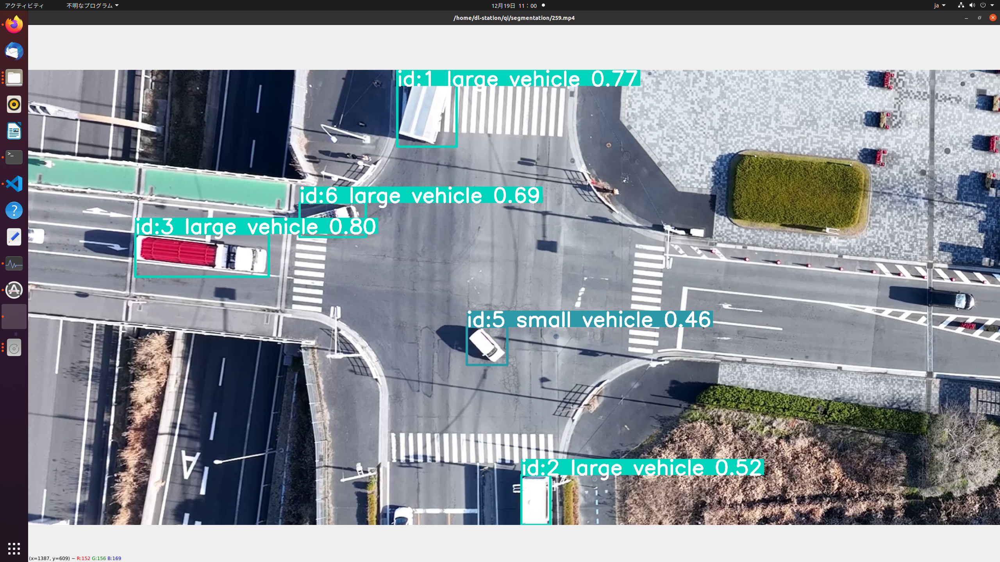
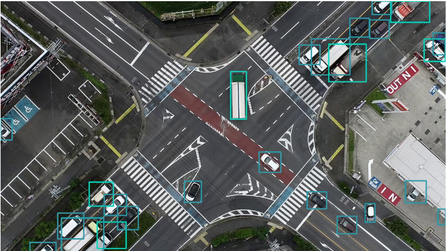
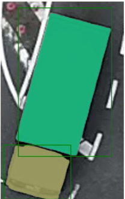
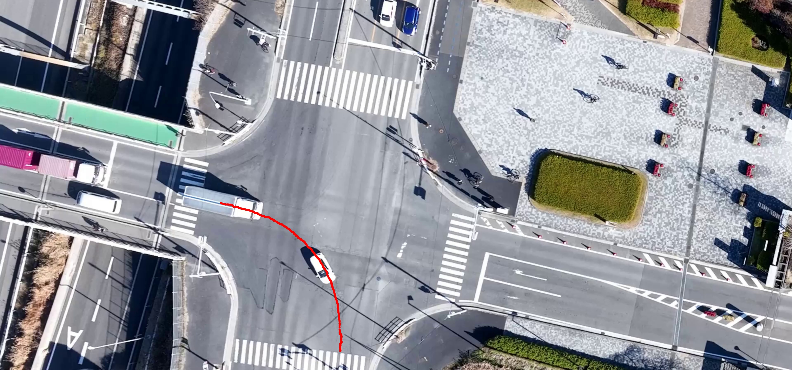
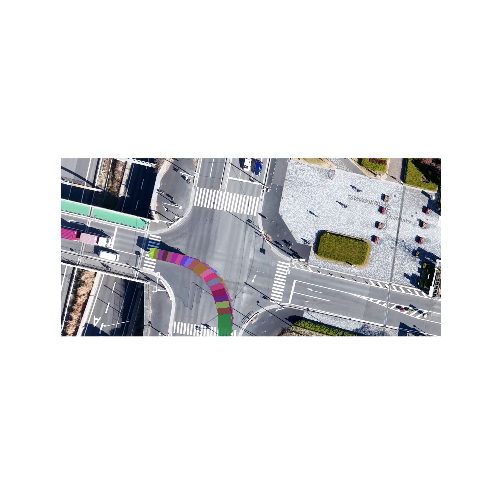

# Segmentation

this repo provides
- python scripts
- .pt model

## showcase

## models
- car detection model: [link](https://drive.google.com/file/d/19w6EodGfI4N5umUrCnogOe-czuRiLX-g/view?usp=drive_link)
- large vehicle head and body detection model: not uploaded

## install dependencies
- use requirement.txt ( only way now )
- use shell.nix( without ultralytics package, can't do models things )

## scripts
clip-video.py
- extract a specific video clip
- Usage: `python3 clip-video.py <video path> <start time> <end time> <output directory>`

get-frame.py
- get a specific frame picture from video(or process a folder of video)
- Usage: `python3 get-frame.py <video_path>/<video_folder_path> <time_str> <output_path>`
- time_str can be exactly '3:42' or vague '1/2'

predict-image.py
- predict objects in image
- Usage: `python3 predict-picture.py <image-path> <model-path>`

track.py
- do tracking
- Usage: `python3 track.py <model path> <source video>`

train.py
- train models
- Usage: `python3 train.py <model path> <yaml path> <epoches>`

train-resume.py
- resume train models
- Usage: `python3 train-resume.py <model path>`

extract-car-image.py
- extract all single car images from a whole image
- Usage: `python3 extract-car-image.py <model path> <image path> <output dir path> <scale factor>`

everything in utils is for specific things, not for general
